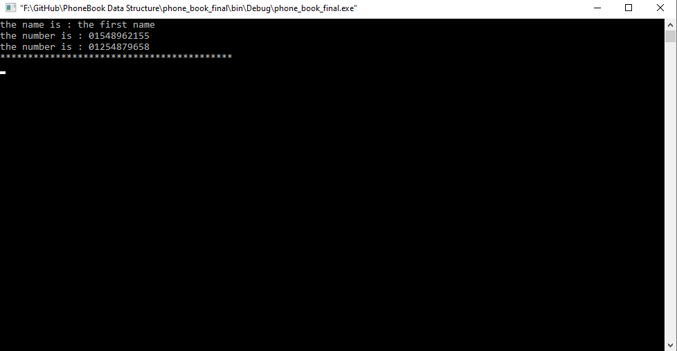

# Phone-Book-DataStructure

The User Can Use This Phone Book To:

1-Add New Contact with multiple numbers.

2-Display All his Contacts.

3-Search about Contact by name or phone.

4-Edit Contact.

5-Delete Contact By Name or Phone.
*********************************************
screenshots from the project:

==> Menu:

==>Add New Contact:

==>Display All Contacts:

==>Search By Name:

==>Search By Phone:

==>Edit Contact:

==>Delete Contact By name OR Phone:

